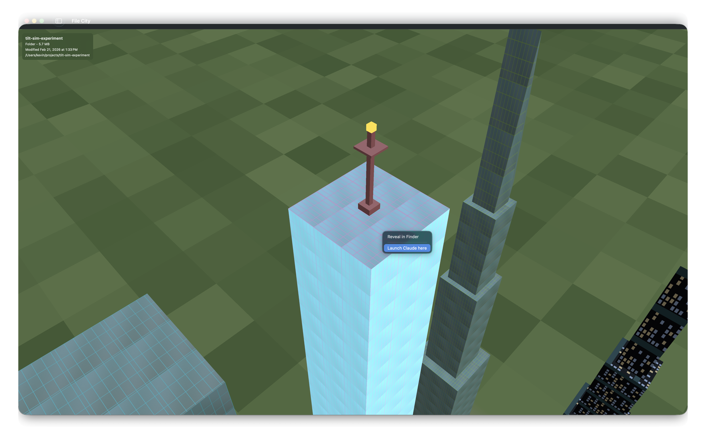
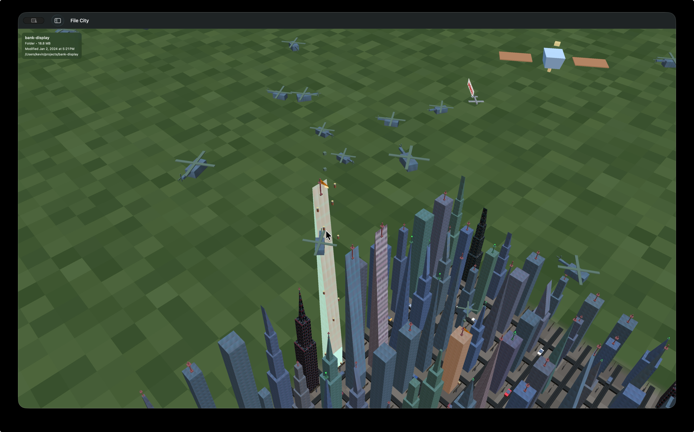

# File City

A native macOS app that renders your file system as a 3D city you can explore, fly through, and use to monitor AI coding agents in real time. Built with Swift and Metal.

<!-- TODO: Add hero screenshot - isometric view of a project directory as a city -->


## What is this?

File City turns any directory on your Mac into a miniature 3D city. Every folder becomes a building, sized proportionally to its contents. You can zoom around in isometric view, drop into first-person mode and walk the streets, or grapple onto a passing plane and pilot it over the skyline.

It was originally built as a visual orchestrator for Claude Code sessions — each running instance appears as a satellite orbiting above the city, and file reads/writes trigger animations on the buildings being touched.

## Features

### Your Files as a City

Directories are scanned and mapped onto a grid of buildings. Larger folders become taller skyscrapers with stacked tiers (base, mid, upper, crown), while small files are short structures. Building shapes, materials, and textures are deterministically generated from file paths, so the same project always looks the same.

<!-- TODO: Add screenshot showing buildings of varying sizes, with skyscraper stacking visible -->


- **7 building shapes** — standard, tapered spires, pyramids, wedges, cylinders
- **Semantic textures** — Swift files get a distinct look, so do images, videos, databases, archives, and more
- **Skyscraper stacking** — large folders get multi-tier buildings with shrinking footprints and decorative crowns
- **Roads and grid layout** — buildings separated by roads with Tesla Model 3s cruising around

### Git Integration

Git repositories get a beacon tower on their building. Green means clean, red means dirty. Hover over a beacon to see the branch name and a summary of changes.

<!-- TODO: Add screenshot showing a beacon tower (green or red) on a building -->


**Time Travel** — scrub a slider through your commit history (up to 200 commits) and watch the city rebuild itself at each point in time.

### First-Person Exploration

Press **F** to drop into first-person mode and walk through your file city at street level. Full FPS controls with collision detection — you can't walk through buildings, but you can jump onto rooftops.

<!-- TODO: Add screenshot from first-person view, standing on a street looking up at buildings -->


| Control | Action |
|---------|--------|
| WASD | Move |
| Mouse | Look around |
| Space | Jump (or toggle flight) |
| Double-tap W | Sprint |
| Shift (hold) | Grapple to target |
| ESC | Exit first-person |

### Grapple System

Hold **Shift** while aiming at any object to fire a grapple and pull yourself toward it. Works on buildings, planes, helicopters, cars, and satellites. Once you arrive, keep holding Shift to ride along.

### Plane Piloting

Multiple planes fly above the city trailing banners that display the current directory name. You can board them.

1. Grapple onto a plane (Shift)
2. Press **E** to board
3. Pilot with full flight physics

<!-- TODO: Add screenshot from the cockpit/third-person view while piloting a plane -->


The flight model includes thrust, lift, drag, gravity, and banking turns. Pull off aerobatic maneuvers with double-tap controls:

| Double-tap | Maneuver |
|------------|----------|
| W | Outside loop |
| S | Inside loop |
| A | Barrel roll left |
| D | Barrel roll right |

### AI Agent Monitoring

The original motivation for File City. When Claude Code (or Codex, Gemini, Cursor) reads or writes files in your project, the city reacts in real time:

<!-- TODO: Add screenshot/GIF showing a helicopter dropping a package on a building, or a beam shooting up -->


- **File write** — a helicopter flies in, hovers above the target building, and drops a package. The package explodes on landing, and a construction worker pops out, slides down the building face, and starts working.
- **File read** — a beam of light shoots up from the building (800 units tall, cyan glow).
- **Building glow** — buildings pulse orange during writes and blue during reads.

The activity monitor tracks process names, so you can see exactly which tool is touching which file.

### Claude Code Satellites

Each running Claude Code session appears as a satellite orbiting above the city. Satellites have solar panels, antenna dishes, and a status beacon that reflects the session state:

<!-- TODO: Add screenshot showing satellites orbiting above the city -->


| State | Visual |
|-------|--------|
| Launching | Dim orange, slow pulse |
| Idle | Bright blue, steady glow |
| Generating | Bright cyan, fast pulse |
| Exiting | Fading out |

You can grapple onto satellites and ride them around their elliptical orbits.

### Other Details

- **Tesla Model 3s** cruise the roads in 12 different colors, with animated wheels, glass canopy, headlights, and taillights
- **Planes explode** when you click on them — 25 debris particles with physics-based trajectories, then they respawn
- **Finder sidebar favorites** appear in the left panel for quick navigation
- **File operations** — create, rename, move, trash files and folders without leaving the app
- **Search** — fuzzy file name search with Cmd+F
- **Construction workers** — up to 100 tiny workers walking around on buildings where files were recently written

## Architecture

```
File City/
├── AppShell/           # SwiftUI views, panels, menus
├── Core/
│   ├── Models/         # FileNode, CityBlock, ClaudeSession
│   ├── Scanner/        # Recursive directory scanning
│   ├── Mapper/         # FileNode tree → CityBlock grid
│   ├── Renderer/       # Metal rendering, cameras, managers
│   │   ├── MetalRenderer.swift      # Main GPU pipeline (~1600 lines)
│   │   ├── Camera.swift             # Isometric + FPS + plane flight
│   │   ├── HelicopterManager.swift  # Helicopter/package/worker system
│   │   ├── SatelliteManager.swift   # Claude session orbital viz
│   │   └── BeamManager.swift        # Light beam effects
│   ├── Watcher/        # FSEvents + privileged helper monitoring
│   ├── Services/       # Git, PTY, Finder favorites
│   ├── Search/         # Fuzzy file search index
│   └── Physics/        # Collision, grapple, flight
├── Resources/
│   ├── Shaders/        # Metal vertex + fragment shaders
│   └── Textures/       # Building textures, font atlas
├── Helper/             # Privileged daemon (SMJobBless) for fs_usage
└── Tests/
```

## Building

Requires macOS and Xcode.

```bash
make install    # Build and install to /Applications
make test       # Run unit tests
```

## License

MIT
